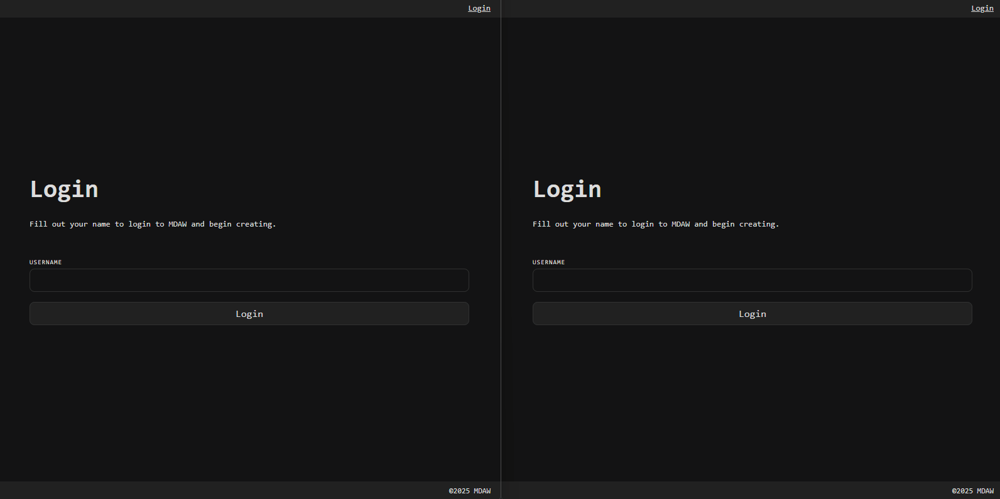

# MDAW
A multi-user digital audio workstation using .NET SignalR web sockets for the server, and React for the client.

# Getting Started
1. Clone the repo
1. Launch a terminal
1. Navigate to the [`./src/Application/MDAW.Server/`](./src/Application/MDAW.Server/) folder
1. Run `dotnet restore` to restore NuGet packages for the server
1. Run `dotnet run` to launch the server
1. Launch another terminal
1. Navigate to the [`./src/Web/MDAW.Client/`](./src/Web/MDAW.Client/) folder
1. Run `npm install` to restore node packages for the client
1. Run `npm run dev` to launch the client

# Architecture
`MDAW.Server` is the server application that uses .NET SignalR to communicate with the clients in real time using web sockets. It uses the hubs defined in `MDAW.Core` to broadcast SignalR endpoints to the client.

`MDAW.Client` is the client application that uses React to surface a front end for the clients to interact with the server and receive SignalR messages over web sockets.